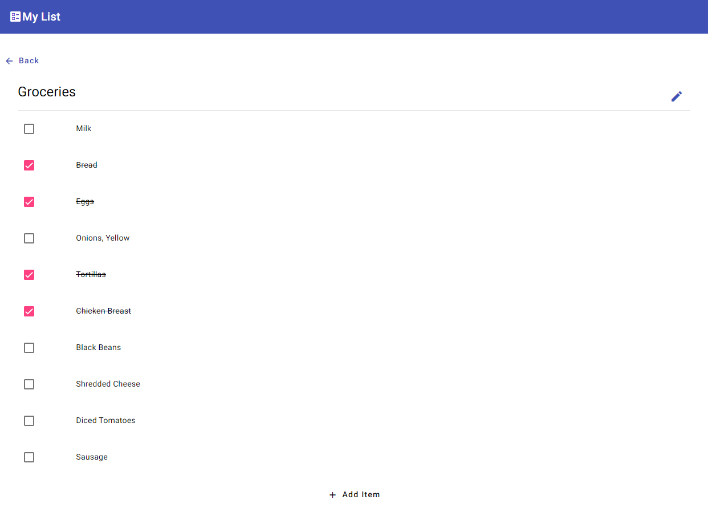
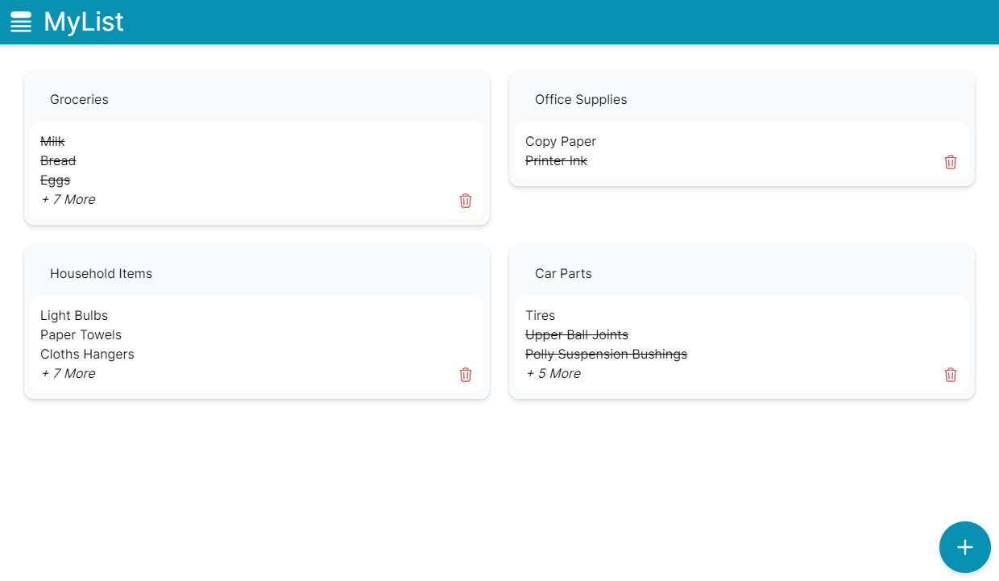
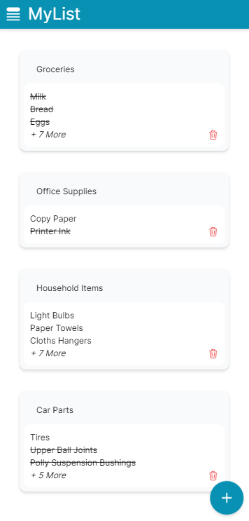

# MyList Web
I build the same UI in both Angular and React. You can read more about the particular implementation in their respective folders.

[Angular](./Angular/README.MD)

[React(Next JS)](./Next.Js/README.MD)

# UI Screenshots

## Angular
### Browser

### Mobile
 | 

## React
### Browser

### Mobile
 | 
